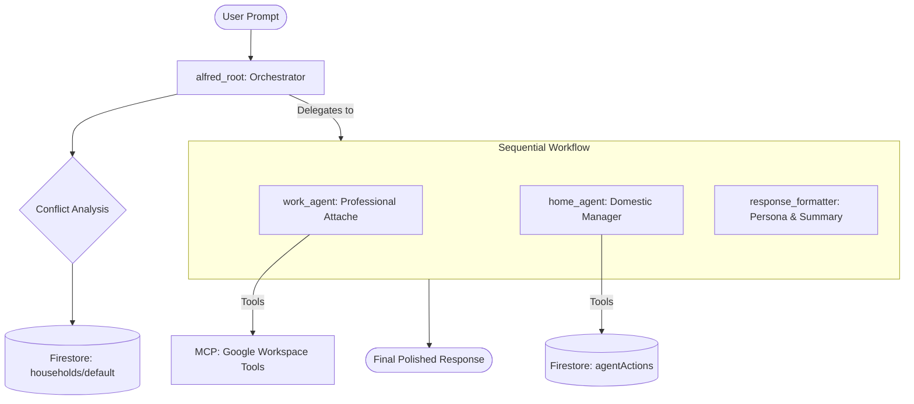

# 🦇 Alfred Agent: System Architecture

This document provides a high-level technical overview of the Alfred Agent project—a multi-agent system designed for cross-domain orchestration between professional duties and private life.

---

## 🏗️ System Overview

Alfred is built on the **Google Agent Development Kit (ADK)** and utilizes **Gemini** (via Vertex AI) as its reasoning engine. It operates as a "Concierge Orchestrator" that delegates tasks to specialized sub-agents based on the user's intent.

### Agent Orchestration Diagram

---

## 🛠️ The Technology Stack

### 1. Core Frameworks
- **AI Engine**: Gemini (Flash 1.5/2.x) via **Vertex AI**.
- **Orchestration**: **Google ADK (Agent Development Kit)**. This framework manages the state, tool calling, and agent-to-agent communication.
- **Protocol**: **MCP (Model Context Protocol)**. Used to interface with the Google Workspace MCP server for Gmail and Calendar access.

### 2. Persistence & Audit (Firestore)
- **Multi-Tenant Isolation**: Data is keyed by the user's Google Email address. User A cannot access User B's household profile or audit logs.
- **`profiles`**: Stores family rules, shopping lists, and domestic state.
- **`audit`**: Chronological record of agent actions per user.

## Security & Privacy

The Alfred Agent implements industry-standard security patterns to protect Master Wayne's most sensitive data:

### Data Encryption
- **At-Rest**: All data in Google Firestore is automatically encrypted by Google using AES-256. 
- **In-Transit**: All communication between the Agent, the MCP server, and Google Cloud services is secured via TLS 1.3 (HTTPS).

### Access Control (IAM)
- **Zero Trust**: The agent uses a dedicated Service Account with the principle of least privilege (roles/datastore.user, roles/logging.logWriter).
- **Identity**: User identity is verified via Google's OAuth2 `userinfo` endpoint on every request.

### Operational Privacy
- Any "Special Gotham Projects" (Work domain) that are flagged as high-priority remain discrete and are only summarized in the final response if relevant to a household conflict.
- **Authentication**: Uses **ADC (Application Default Credentials)** on Cloud Run and manual **OAuth tokens** in local `.env` for development.
- **Configuration**: Managed via environment variables synced with Secret Manager.

---

## 🤖 Agent Hierarchy

### `alfred_root` (The Orchestrator)
- **Role**: Entry point and conflict resolver.
- **Responsibility**: Translates relative dates, detects "Gotham/Special Project" priority, and determines if a request overlaps multiple domains.

### `work_agent` (The Professional Attache)
- **Role**: Specialist for Google Workspace.
- **Responsibility**: Strictly manages professional meetings, emails, and syncs. Filtered to ignore personal events (Zumba, Birthdays).

### `home_agent` (The Domestic Manager)
- **Role**: Specialist for Household Coordination.
- **Responsibility**: Manages errands and domestic logging. Reactive in nature to prevent hallucinations.

### `response_formatter` (The Persona)
- **Role**: Pure persona layer.
- **Responsibility**: Summarizes multi-agent outputs into the Alfred Pennyworth voice.

---

## 🔐 Security & Data Flow

1. **Authentication**: Agents use a provided Access Token to communicate with the MCP Server.
2. **Stateless Logic**: The system follows a "Zero Trust" model where each analysis turn starts with a fresh read from the Firestore context.
3. **Auditability**: Every write operation is recorded with an agent ID and timestamp in the `agentActions` collection.

*"Be present at work. Be present at home. I shall handle the rest."*
